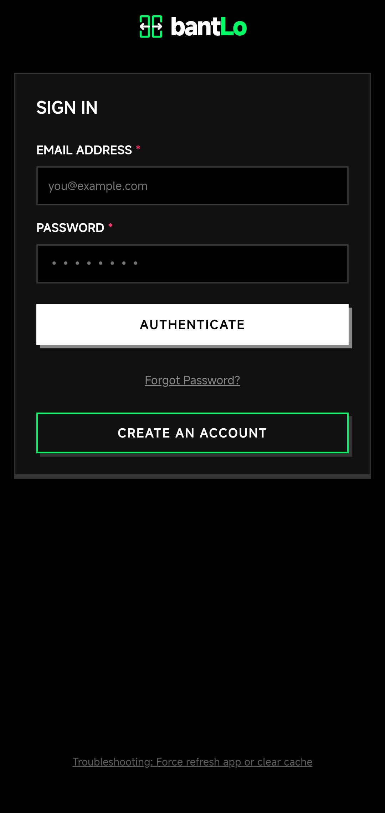
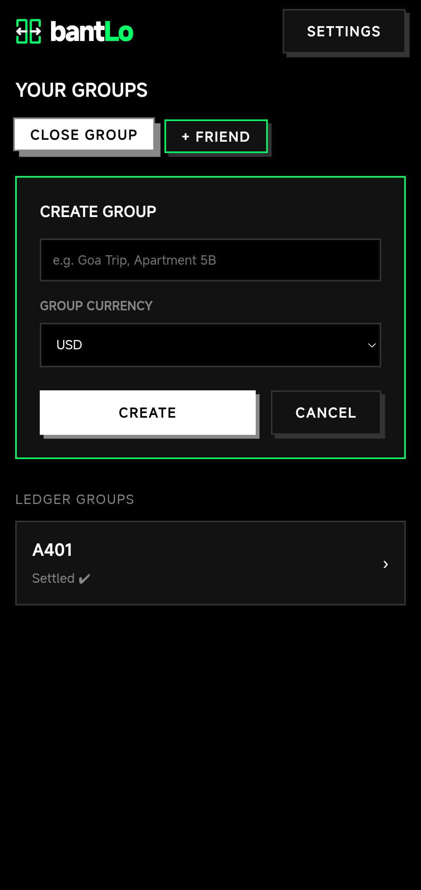
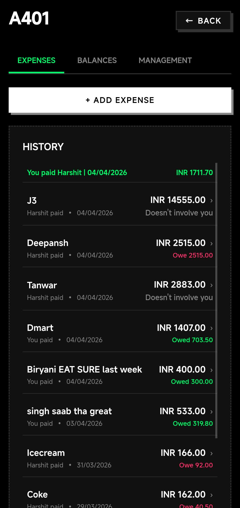
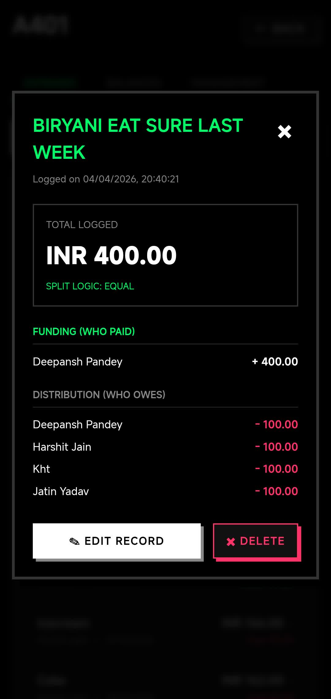
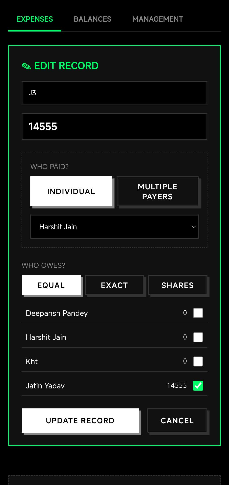
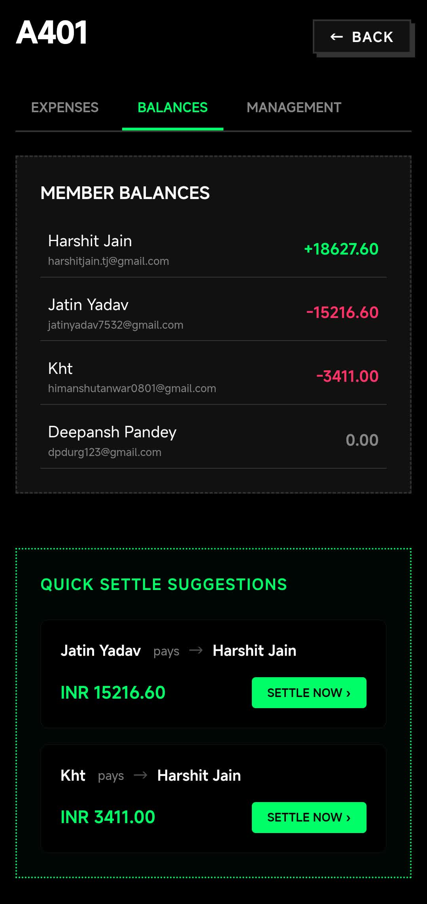
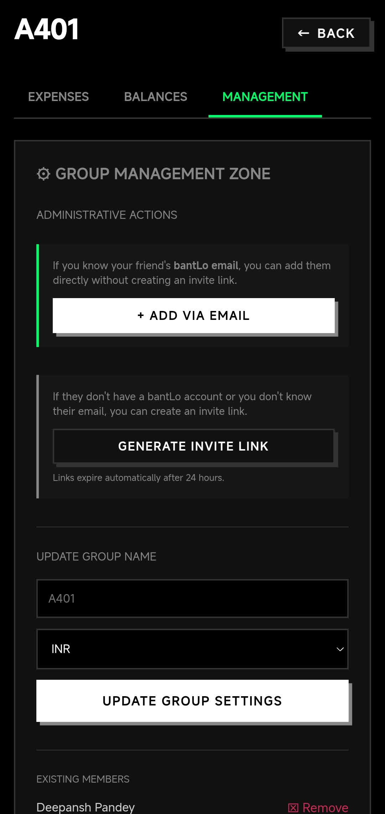
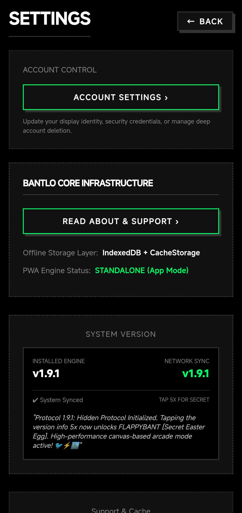
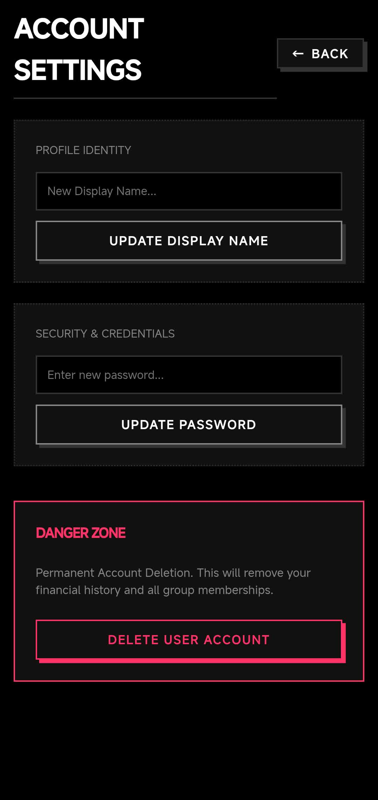

<div align="center">
  
  <h1>bantLo</h1>
  <p><strong>A Pitch-Black, Offline-First, Mathematically Rigid Expense Splitter</strong></p>
  
  [](https://github.com/bantLo)
  [](https://pages.cloudflare.com)
  [](https://supabase.com)
</div>

---

## ⚡ The NeoPop Split-Engine

**bantLo** is a brutalist Progressive Web App (PWA) engineered for precision debts and offline resilience. Designed as a high-contrast alternative to subscription-heavy apps like Splitwise, bantLo ensures you never lose access to your balances, even in the middle of a cellular dead zone.

### 🚀 Core Features

- 🔌 **Offline-First Resilience**: Full PWA capabilities using Service Workers (App Shell) and IndexedDB (Data Caching). Syncs seamlessly when connection returns.
- 🧮 **Precision Math Engine**:
  - **Equal Splits**: Distributes totals evenly, intelligently managing fractional pennies.
  - **Exact Splits**: Validates total sums identically to manual user input.
  - **Shares**: Proportional weight-based splitting (e.g., 2:1 for couples vs. singles).
- 🔒 **Hardened Security**: Protected by Supabase Row-Level Security (RLS) policies. No untrusted backend middleware.
- 📱 **Native PWA**: Bypasses landing pages in standalone mode for a native mobile experience.
- 🎨 **NeoPop Brutalist UI**: High-contrast, pitch-black themes with tactile mechanical feedback. No fluff, just math.

## 📸 Inside the Interface

<table width="100%">
  <tr>
    <th width="20%">1. Auth & Login</th>
    <th width="20%">2. Your Groups</th>
    <th width="20%">3. Ledger Setup</th>
    <th width="20%">4. Expense History</th>
    <th width="20%">5. Transaction Detail</th>
  </tr>
  <tr>
    <td></td>
    <td></td>
    <td></td>
    <td></td>
    <td></td>
  </tr>
  <tr>
    <th width="20%">6. Split Logic</th>
    <th width="20%">7. Debt Settlement</th>
    <th width="20%">8. Member Management</th>
    <th width="20%">9. System Integrity</th>
    <th width="20%">10. Account Security</th>
  </tr>
  <tr>
    <td></td>
    <td></td>
    <td></td>
    <td></td>
    <td></td>
  </tr>
</table>

---

## 🛠️ Self-Hosting Guide

Deploying your own instance of **bantLo** is simple and requires only free-tier services from Supabase and Cloudflare.

### 1. Backend Setup (Supabase)

1.  **Create a Supabase Project**: Head to [Supabase](https://supabase.com) and spin up a new PostgreSQL project.
2.  **Initialize Database**:
    - Open the **SQL Editor** in your Supabase dashboard.
    - Copy and paste the entire contents of [`DB_Query.sql`](./DB_Query.sql).
    - **Run** the query. This sets up all tables, triggers, and RLS security policies.
3.  **Get Credentials**:
    - Go to **Project Settings** -> **API**.
    - Note down your `Project URL` and `anon public` Key.

### 2. Frontend Deployment (Cloudflare Pages)

1.  **Connect Repository**: Link your forked repository to [Cloudflare Pages](https://pages.cloudflare.com).
2.  **Configure Build Settings**:
    - **Framework Preset**: `Vite` (or `None`).
    - **Build Command**: `npm run build`
    - **Build Output Directory**: `dist`
3.  **Environment Variables**:
    - Add the following variables in the **Settings -> Environment Variables** section of your Pages project:
      - `VITE_SUPABASE_URL`: (Your Supabase Project URL)
      - `VITE_SUPABASE_ANON_KEY`: (Your Supabase Anon Key)
4.  **Deploy**: Hit "Save and Deploy". Your PWA is now live!

---

## 💻 Local Development

1.  **Clone & Install**:
    ```bash
    git clone https://github.com/bantLo/bantLo-pages.git
    cd bantlo-pages
    npm install
    ```
2.  **Configure `.env`**:
    Create a `.env` file in the root based on your Supabase credentials:
    ```env
    VITE_SUPABASE_URL=your_url
    VITE_SUPABASE_ANON_KEY=your_key
    ```
3.  **Start Dev Server**:
    ```bash
    npm run dev
    ```

---

## 📄 License & Attribution

bantLo is open-source and intended for community use. 

> [!NOTE]
> Splitwise is a trademark of Splitwise, Inc. bantLo is an independent project and is not affiliated with, sponsored by, or endorsed by Splitwise, Inc.

*Made with 💝 for precision and privacy.*
